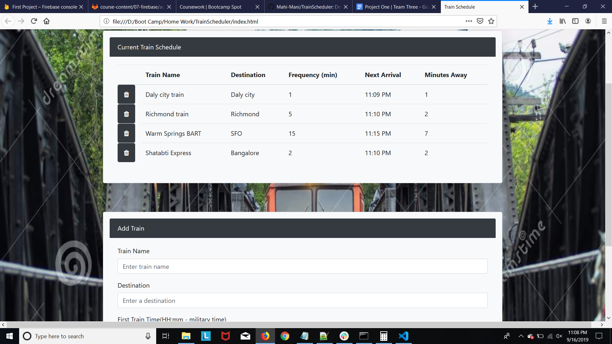
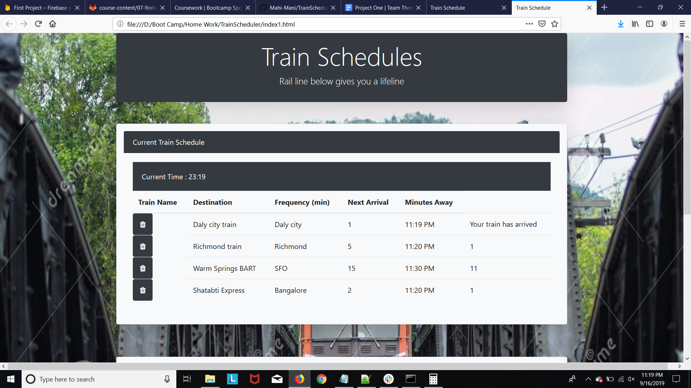

# Train Scheduler

## Site pictures



## Technologies Used
- HTML : used to create elements on the DOM
- Bootstrap  : Styles html elements on page
- Javascript : used to provide interative effects
- JQuery : event handling, DOM manipulation
- Firebase : Used database to store datas
- Git : version control system to track changes to source code
- GitHub : hosts repository that can be deployed to GitHub pages

## Summary
### Train Scheduler application benifits user on showcasing schedules of different train user wishes to view. User can add new train at any point to view schedule. Minutes away field and next arrival keeps updating every minute so that user can keep track of their train.

## Code Snippet
```Javascript

    // ***********************************************************
    // This code snippet is executed upon a click of submit button
    // ***********************************************************
    $("#submit").on("click",function (event){
        // Prevents page from refreshing
        event.preventDefault(); 
        // Calculates current time and updates to html page
        now = new moment().format("HH:mm");
        $("#sysTime").text(now);
        // Gets user inputs 
        name = $("#input-name").val();
        dest = $("#input-dest").val();
        time = $("#input-time").val();
        freq = $("#input-freq").val();
        // Function to calculate train schedule
        timeCalc();
        // Function that pushes data to firebase
        pushToDatabase();
    }
```


## Author Links
[LinkedIn](https://www.linkedin.com/in/mahisha-gunasekaran-0a780a88/)

[GitHub](https://github.com/Mahi-Mani)

